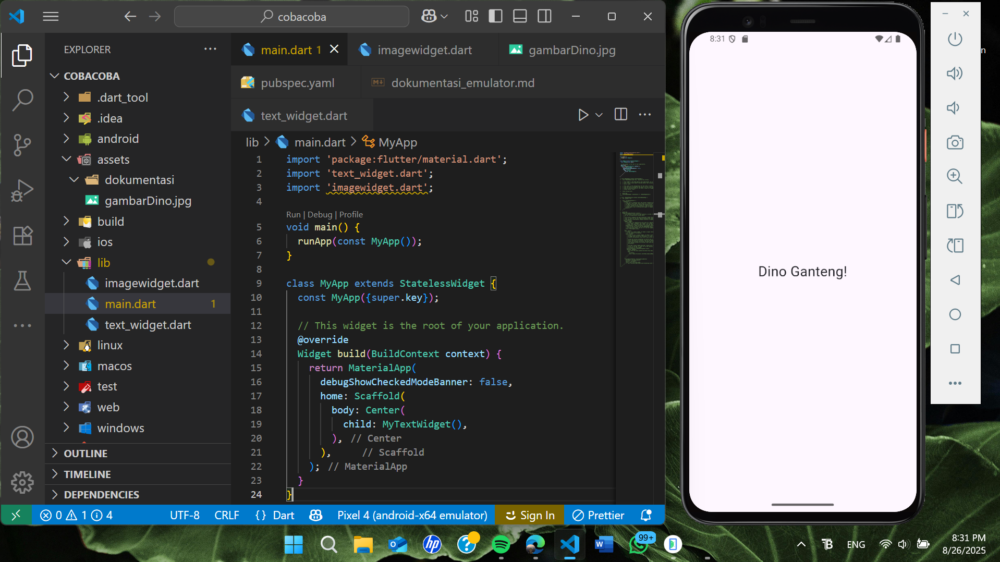
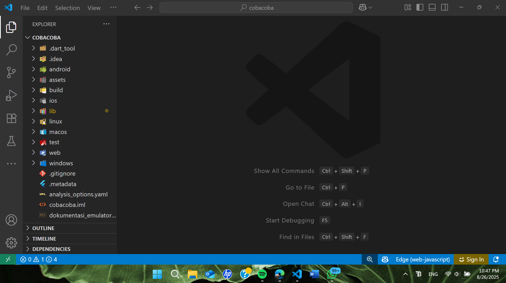
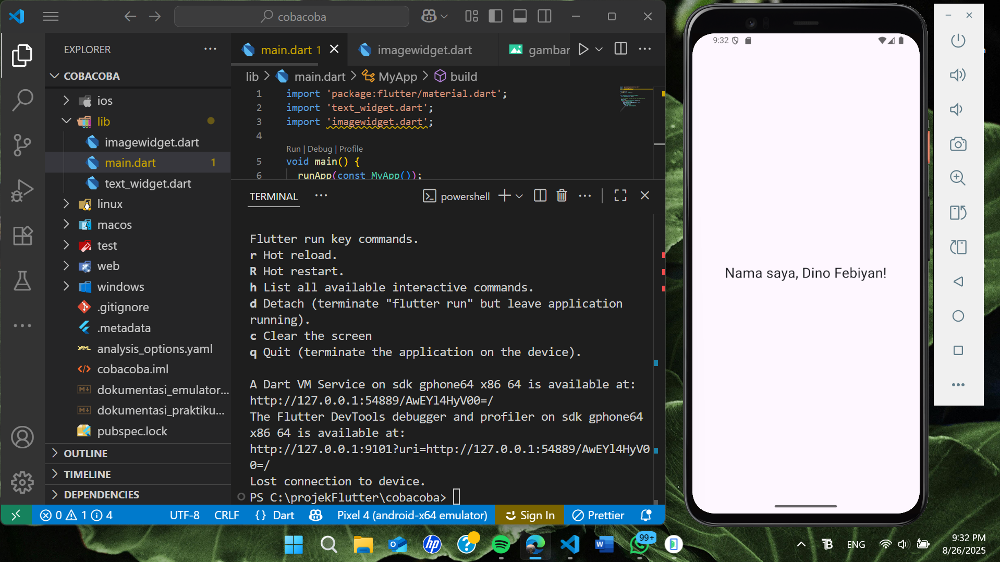
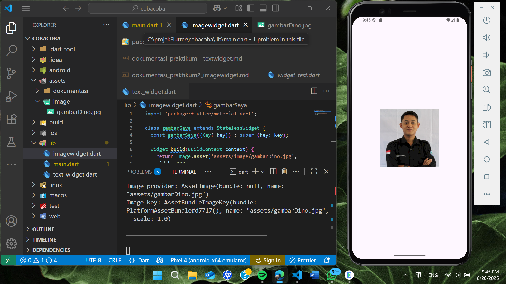

##DOKUMENTASI PEMBUATAN DAN PENGGUNAAN EMULATOR ANDROID UNTUK PEMOGRAMAN PERANGKAT BERGERAK MENGGUNAKAN FLUTTER##
362458302043_Dino Febiyan

Dalam proses pengembangan aplikasi mobile khususnya android tentunya kita tidak hanya menggunakan code editor saja, namun juga menggunakan tools-tools lain yang bisa membantu kita dalam mempermudah pekerjaan dan membuat pekerjaan menjadi lebih efektif. Salah satu tools yang bisa digunakan adalah emulator. Emulator berfungsi sebagai perangkat virtual yang bisa digunakan untuk menjalankan serta menguji aplikasi yang sedang dikembangkan tanpa perlu menggunakan perangkat.
Sebenarnya, saat mengembangkan aplikasi mobile, kita juga bisa menggunakan perangkat hp yang kita miliki, namun dikarenakan saya tidak memiliki hp android, sehingga saya tidak bisa menggunakannya sebagai preview untuk pengembangan mobile berbasis android. Emulator ini sangat membantu saya untuk bisa tetap mengembangkan aplikasi android tanpa harus memiliki device android.
Sayangnya, Emulator ini tidak tersesdia secara langsung di code editor sehingga perlu pengintalasian dan pemasangan serta pengintegrasian saat kita ingin menggunakannya. Berikut merupakan langkah-langkah yang saya lakukan untuk bisa menggunakan emulator ini sebagai salah satu tools pendukung saya dalam mengembangkan aplikasi mobile berbasis android:

1. Menginstal android studio
Saat ingin menggunakan emulator khususnya untuk emulator android, kita tidak bisa langsung menginstalnya di code editor biasa, perlu ada software khusus yang kita gunakan. Software tersebut adalah android studio. Android studio ini adalah software yang bisa mendukung kita dalam melakukan pengembangan aplikasi mobile berbasis android, didalamnya sudah terdapat fitur khusus yaitu virtual device yang mana bisa kita gunakan untuk sebagai emulator nantinya. Sebenarnya disini juga ada code editornya seperti di vs code, namun karena saya lebih terbiasa menggunakan vs code saya akan mengintegrasikan virtual device ini juga ke vs code. Sehingga android studio hanya saya gunakan untuk menginstal android sdk yang nanti dibutuhkan untuk melakyukan pengembangan aplikasi android dan hanya sebagai penyedia emulator saja.
2. Membuat Emulator Android 
Setelah Android Studio berhasil diinstal, saya membuka aplikasi tersebut dan masuk ke menu Virtual Device Manager. Di sana saya memilih opsi Create Virtual Device untuk membuat emulator baru. Sebenarnya sudah ada bawaan dari android studio sendiri, namun saat saya mencobanya tampilannya jelek, sehingga saya menginstal Virtual Device baru. Saya memilih tipe perangkat tipe perangkat pixel 4 dan versi sistem operasi Android 16. Setelah memilih ini kita akan ditujukan ke halaman konfigurasi yang mana disini kita bisa menyesuaikan emulator yang akan kita buat dengan keinginan kita. Saya memilih internale storagenya 4 gb, ram 2gb dan cpu 4 core sehingga tidak terlalu memberatkan laptop saya. Setelah konfigurasi selesai, saya mengklik Finish dan emulator sudah bisa kita gunakan.
3. Menjalankan Emulator
Untuk menjalankan emulator, saya hanya cukup mengklik tombol start di bagian paling kanan emulator dan emulator otomatis bisa dijalankan dan terbuka otomatis.
4. Integrasi dengan Flutter
Setelah memastikan emulator hidup, saya membuka proyek saya di vs code dan mengklik bar di bagian bawah code editor yang bagian device conected, yang kita lakukan pertama kali adalah memastikan bahwa emulator yang sebelumnya kita buat sudah masuk ke bagian available Device. Jika belum maka kita perlu memastikan bahwa emulator sudah benar benar hidup. jika sudah di available device kita hanya perlu mengklik saja yang bagian emulator yang sebelumnya kita buat. ada dua pilihan yaitu cold boot dan quick boot. Saat saya melanjutkan proyek yang sebelumnya sudah saya telah coba maka saya menggunakan quick boot, jika tidak dan ingin memulai ulang emulator saya memakai cold boot. Hal ini dikarenakan cold boot seperti menghidupkan hp yang habis si shutdown sedangkan quick boot menghidupkan hp yang habis di sleep. Sehingga nantinya pun akan berbeda, jika quick boot data sebekumnya masih ada dan cold boot tidak, terus jika quick boot maka proses bootingnya akan lebih cepat. Setelah kita selesai memilih emulator yang akan kita gunakan langkah selanjutnya adalah menjalankan flutter run di terminal maka proyek kita akan langsung menampilkan previewnya di emulator. Jika kita ingin mereloadnya kita bisa menggunakan r untuk melakukan hot reload.

Berikut merupakan screenshoot saat saya menggunakan emulator sambil membuka proyek:

##DOKUMENTASI PEMBUATAN WIDGET TEXT UNTUK ANDROID MOBILE MENGGUNAKAN FRAMEWORK FLUTTER##
362458302043_Dino Febiyan

Setelah membuat emulator dan menghubungkannya, saya akan mencoba membuat widget baru sebagai bahan percobaan, widget yang saya buat disini adalah text widget yang akan menampilkan sebuah teks di layar, berikut penjelasan per langkah langkahnya:

Sebelum itu saya akan menjelaskan terlebih dahulu cara pembuatan proyek baru flutter untuk mengembangkan aplikasi android di vs code. Berikut adalah langkah langkahnya:
1. Buka VS Code, lalu tekan tombol Ctrl + Shift + P maka akan tampil Command Palette, lalu ketik Flutter da. pilih New Application Project.
2. Kemudian kita diminta memilih folder untuk menyimpan projek lalu, selain itu kita juga bisa membuat folder baru agar lebih khusus. Jika sudah ada foldenya selanjutnya pilih Select a folder to create the project in.
3. Selanjutnya kita diminta memasukkan nama project, disini saya menamakannya dengan COBACOBA saja, lalu tekan Enter. lalu kita tunggu sampai proses pembuatan project baru selesai.
4. Jika sudah selesai maka ada beberapa folder dan file yang akan muncul otomatis dan muncul juga pesan yang akan tampil berupa "Your Flutter Project is ready!" yang berarti kita telah berhasil membuat project Flutter baru.
berikut adalah contoh screenshoot jika kkita sudah berhasil membuat proyek baru:

Setelah membuat proyek baru, saya akan menjelaskan langkah-langkah pembuatan widget text sebagai berikut:
1. File Default Saat Pembuatan Proyek Baru
Saat proyek baru dibuat, Flutter akan otomatis membuat struktur folder dan file default, didalamnya juga ada file utama yaitu lib/main.dart dan file pengujian test/widget_test.dart yang bisa langsung kita coba.
2. Menghapus Kode yang Tidak Diperlukan
Pada file main.dart, terdapat kode default seperti MyHomePage, counter, dan fungsi setState() yang digunakan untuk aplikasi demo berbasis StatefulWidget. Karena saya hanya ingin menampilkan teks statis, saya menghapus bagian bagian tersebut agar kode menjadi lebih sederhana dan hanya agar fokus pada penggunaan StatelessWidget dan Text Widget.
3. Pemisahan File Widget
Saya membuat file baru bernama text_widget.dart di dalam folder lib/ untuk menyimpan kode text widget. Pemisahan ini bertujuan agar kode lebih mudah dibaca, memudahkan pengelolaan jika ada banyak widget, dan agar kode saya menjadi lebih rapi dan terstruktur.
4. Kode Text Widget
Isi dari file text_widget.dart adalah kode khusus untuk membuat widget berbentuk teks, berikut merupakan penjelasan saya untuk kode kode yang ada didalam file tersebut:
    -  StatelessWidget: digunakan karena teks yang ditampilkan bersifat statis dan tidak berubah.
    - Widget build(BuildContext context): adalah metode wajib yang digunakan untuk membangun tampilan UI.
    - Text(...): widget bawaan Flutter untuk menampilkan teks.
    - TextStyle(...): digunakan untuk mengatur ukuran font.
    - textAlign: TextAlign.center: agar teks berada di tengah layar.
5. Pengintegrasian ke main.dart
Di file main.dart, saya mengimpor text_widget.dart dan menampilkan widget, berikut merupakan penjelasan saya terhadap kode kode yang ada didalam file tersebut:
    - MaterialApp: adalah root widget yang menyediakan tema dan navigasi berbasis Material Design.
    - debugShowCheckedModeBanner: false: digunakan untuk menghilangkan banner "Debug" di pojok kanan atas emulator.
    - Scaffold: menyediakan struktur dasar aplikasi seperti AppBar, Body, dan Drawer.
    - body: area utama tempat konten ditampilkan.
    - Center: widget yang memposisikan child-nya di tengah layar.
    - child: adalah widget yang ditampilkan di dalam Center, dalam hal ini MyTextWidget().
6. Hasil
Berikut adalah tampilan aplikasi yang berhasil dijalankan di emulator Android:

dari screenshoot diatas bisa dilihat bahwa di emulator bisa tertampil sebuah text yang berada ditengah device

##DOKUMENTASI PEMBUATAN WIDGET IMAGE UNTUK ANDROID MOBILE MENGGUNAKAN FRAMEWORK FLUTTER##
362458302043_Dino Febiyan

Setelah membuat widget text yang menampilkan text, saya akan mencoba membuat widget gambar yang mana widget ini akan menampilkan gambar di layar, berikut penjelasan langkah langkahnya:

1. Penempatan gambar sebagai persiapan sebelum membuat kode
Untuk menampilkan gambar dalam aplikasi Flutter, saya lebih dahulu menyiapkan file gambar yang nantinya akan saya gunakan. Gambar tersebut saya simpan di folder khusus yaitu assets/image/ alasan folder ini dipisahkan dari folder lib/ karena gambar termasuk dalam kategori asset, bukan kode program. Sesuai praktik yang baik dalam pengembangan Flutter, asset seperti gambar, ikon, atau font sebaiknya disimpan di luar folder lib agar struktur proyek lebih rapi dan terorganisir.
2. Penyesuaian path di pubspec.yaml
Agar Flutter dapat mengenali gambar yang saya simpan, saya melakukan konfigurasi pada file pubspec.yaml dengan menambahkan path asset di bagian flutter: assets:. Dibawahnya saya tambahkan lokasi dari gambar yang sebelumnya saya siapkan yaitu assets/image/gambarDino.jpg. Setelah menambahkan konfigurasi tersebut, saya menjalankan perintah flutter pub get di terminal agar flutter bisa memuat ulang dependensi dan asset agar bisa saya gunakan nantinya.
3. Pembuatan file imagewidget.dart
Saya membuat file baru bernama imagewidget.dart di dalam folder lib/, yang berisi kode untuk menampilkan gambar. berikut merupakan penjelasan kode-kode didalamnya:
    - StatelessWidget: digunakan karena gambar yang ditampilkan bersifat statis dan tidak berubah.
    - Image.asset(...): digunakan untuk menampilkan gambar dari folder asset.
    - width dan height: mengatur ukuran gambar.
    - fit: BoxFit.cover: memastikan gambar memenuhi area yang disediakan tanpa distorsi.
4. Integrasi ke main.dart
untuk proses integrasinya sebenarnya sama dengan yang di dokumentasi text widget sebelumnya, hanya saja disini saya import lokasi yang menyimpan imagewidget saja dan pada bagian yang sebelumnya memanggil fungsi untuk menampilkan teks, sekarang saya ubah jadi fungsi yang menampilkan gambar yang ada didalam file image widget.
5. Hasil
Berikut adalah tampilan akhir aplikasi Flutter yang berhasil dijalankan di emulator:

dari screenshoot diatas bisa dilihat bahwa di emulator bisa tertampil sebuah gambar yang berada ditengah device.