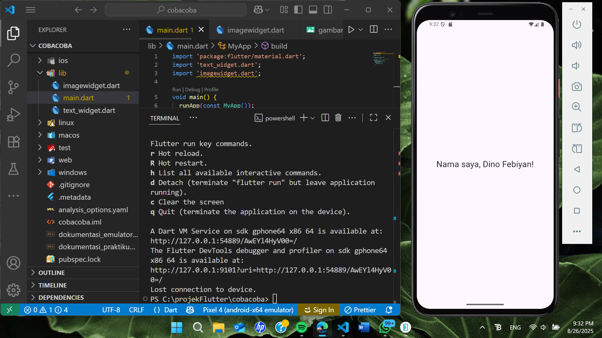

##DOKUMENTASI PEMBUATAN WIDGET TEXT UNTUK ANDROID MOBILE MENGGUNAKAN FRAMEWORK FLUTTER##
362458302043_Dino Febiyan

Setelah membuat emulator dan menghubungkannya, saya akan mencoba membuat widget baru sebagai bahan percobaan, widget yang saya buat disini adalah text widget yang akan menampilkan sebuah teks di layar, berikut penjelasan per langkah langkahnya:

Sebelum itu saya akan menjelaskan terlebih dahulu cara pembuatan proyek baru flutter untuk mengembangkan aplikasi android di vs code. Berikut adalah langkah langkahnya:
1. Buka VS Code, lalu tekan tombol Ctrl + Shift + P maka akan tampil Command Palette, lalu ketik Flutter da. pilih New Application Project.
2. Kemudian kita diminta memilih folder untuk menyimpan projek lalu, selain itu kita juga bisa membuat folder baru agar lebih khusus. Jika sudah ada foldenya selanjutnya pilih Select a folder to create the project in.
3. Selanjutnya kita diminta memasukkan nama project, disini saya menamakannya dengan COBACOBA saja, lalu tekan Enter. lalu kita tunggu sampai proses pembuatan project baru selesai.
4. Jika sudah selesai maka ada beberapa folder dan file yang akan muncul otomatis dan muncul juga pesan yang akan tampil berupa "Your Flutter Project is ready!" yang berarti kita telah berhasil membuat project Flutter baru.
berikut adalah contoh screenshoot jika kkita sudah berhasil membuat proyek baru:

Setelah membuat proyek baru, saya akan menjelaskan langkah-langkah pembuatan widget text sebagai berikut:
1. File Default Saat Pembuatan Proyek Baru
Saat proyek baru dibuat, Flutter akan otomatis membuat struktur folder dan file default, didalamnya juga ada file utama yaitu lib/main.dart dan file pengujian test/widget_test.dart yang bisa langsung kita coba.
2. Menghapus Kode yang Tidak Diperlukan
Pada file main.dart, terdapat kode default seperti MyHomePage, counter, dan fungsi setState() yang digunakan untuk aplikasi demo berbasis StatefulWidget. Karena saya hanya ingin menampilkan teks statis, saya menghapus bagian bagian tersebut agar kode menjadi lebih sederhana dan hanya agar fokus pada penggunaan StatelessWidget dan Text Widget.
3. Pemisahan File Widget
Saya membuat file baru bernama text_widget.dart di dalam folder lib/ untuk menyimpan kode text widget. Pemisahan ini bertujuan agar kode lebih mudah dibaca, memudahkan pengelolaan jika ada banyak widget, dan agar kode saya menjadi lebih rapi dan terstruktur.
4. Kode Text Widget
Isi dari file text_widget.dart adalah kode khusus untuk membuat widget berbentuk teks, berikut merupakan penjelasan saya untuk kode kode yang ada didalam file tersebut:
    -  StatelessWidget: digunakan karena teks yang ditampilkan bersifat statis dan tidak berubah.
    - Widget build(BuildContext context): adalah metode wajib yang digunakan untuk membangun tampilan UI.
    - Text(...): widget bawaan Flutter untuk menampilkan teks.
    - TextStyle(...): digunakan untuk mengatur ukuran font.
    - textAlign: TextAlign.center: agar teks berada di tengah layar.
5. Pengintegrasian ke main.dart
Di file main.dart, saya mengimpor text_widget.dart dan menampilkan widget, berikut merupakan penjelasan saya terhadap kode kode yang ada didalam file tersebut:
    - MaterialApp: adalah root widget yang menyediakan tema dan navigasi berbasis Material Design.
    - debugShowCheckedModeBanner: false: digunakan untuk menghilangkan banner "Debug" di pojok kanan atas emulator.
    - Scaffold: menyediakan struktur dasar aplikasi seperti AppBar, Body, dan Drawer.
    - body: area utama tempat konten ditampilkan.
    - Center: widget yang memposisikan child-nya di tengah layar.
    - child: adalah widget yang ditampilkan di dalam Center, dalam hal ini MyTextWidget().
6. Hasil
Berikut adalah tampilan aplikasi yang berhasil dijalankan di emulator Android:

dari screenshoot diatas bisa dilihat bahwa di emulator bisa tertampil sebuah text yang berada ditengah device